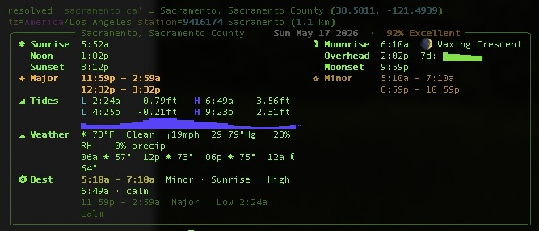
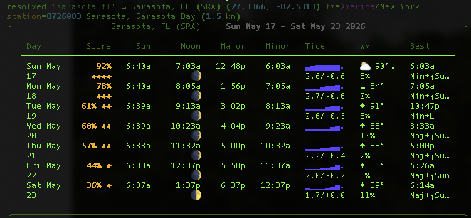
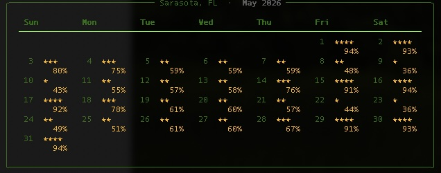
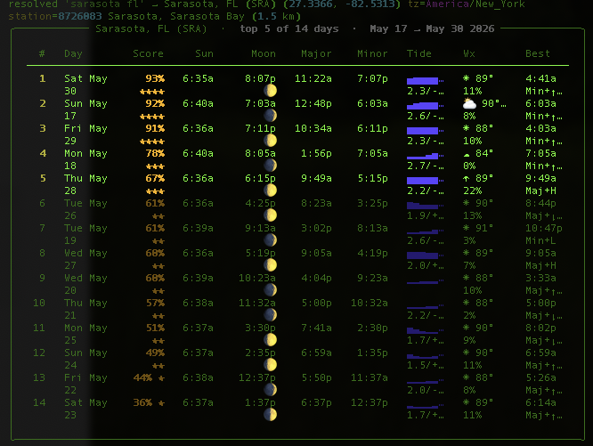

# fishin

[](https://github.com/sponsors/sjwasko)
[](https://buymeacoffee.com/sutibu)

Terminal solunar, tide, and weather forecast — one command, full picture, btop-dense layout.



`fishin` rolls a solunar app, a tide app (xtides-style), and `wttr.in` into a single
terminal panel. Solunar major/minor periods, sun/moon ephemera, NOAA tide
predictions, open-meteo weather, and a per-day "best fishing window" cross-correlation
all rendered in ~12 terminal lines per day.

## Install

```bash
pipx install fishin
```

Or, for the bleeding-edge `main` branch:

```bash
pipx install git+https://github.com/sjwasko/fishin.git
```

Requires Python ≥ 3.11. Works on Linux, macOS, and Windows
(see [Windows note](#windows) below).

First run downloads the JPL DE421 ephemeris (~17 MB) into `~/.cache/fishin/ephemeris/`.
NOAA, open-meteo, and Nominatim responses are cached at `~/.cache/fishin/responses/`.

### Windows

Requires **Windows 10 or later** and **Windows Terminal** — the classic
PowerShell / `cmd.exe` consoles don't have the right Unicode glyphs for the
tide-curve sparkline and won't render the amber palette correctly.

Install Windows Terminal if you don't already have it (it ships by default on
Windows 11):

```powershell
winget install --id Microsoft.WindowsTerminal -e
```

Then set it as the default terminal for all command-line apps:

**Settings → System → Advanced → Terminal → Windows Terminal**

After that, any new `fishin` invocation opens in Windows Terminal and the
panel renders correctly.

## Set your location

Out of the box, `fishin` uses Sarasota, FL as a fallback. To make it use your
own location and have it **stick across runs**, geocode a place name once and
save it as your default:

```bash
fishin --city "your town st" --save
```

From then on, plain `fishin` (no flags) uses your saved location. The resolved
coordinates, timezone, and nearest NOAA tide station are written to
`~/.config/fishin/config.toml`.

`--city` without `--save` is a one-shot — useful for checking conditions
somewhere you don't usually fish without overwriting your default:

```bash
fishin --city "key west fl"
```

Inland queries (>100 km from the nearest NOAA tide station) automatically
drop the tide section — there are no ocean tides in Austin.

## Quick start

```bash
fishin                          # full panel for today, your saved location
fishin 7                        # compact 7-day list view
fishin month                    # 30-day calendar grid with star ratings
fishin best 14                  # next 14 days ranked, top 5 highlighted
fishin --date 2026-06-15        # any specific date
fishin --no-tides --no-weather  # astro-only, no network
```

`fishin --help` lists every flag plus more examples.

## Modes

| Command | Output |
|---|---|
| `fishin` | One full panel for today |
| `fishin N` | N-day list view, one row per day |
| `fishin month` | Calendar grid for the month of `--date` |
| `fishin best N` | Next N days sorted by score, top 5 highlighted |
| `fishin --days N` | Legacy: render N full panels back-to-back |

Skip network fetches with `--no-tides` / `--no-weather` (e.g. offline or for quick recompute).

## Views

### Day panel


### 7-day list



### Month grid



### Best 14 days, ranked



## Configuration

The easy path is `fishin --city "..." --save` (described above). If you'd
rather hand-edit, the file lives at `~/.config/fishin/config.toml`:

```toml
location = "Sarasota, FL"
lat = 27.3366
lon = -82.5313
tz = "America/New_York"
station = "8726083"
```

Resolution order: explicit flags > `--city` > config file > built-in default.

## How the "Best" ranking works

Every major/minor period is scored:

| Factor | Weight |
|---|---|
| Major period base | +4 |
| Minor period base | +2 |
| Sunrise overlap (±1 hr) | +3 |
| Sunset overlap (±1 hr) | +3 |
| Each H/L tide overlap (±30 min) | +2 |
| Calm wind (≤6 mph) | +1 |
| Strong wind (≥18 mph) | −1 |
| Rain ≥60% | −2 |

Top two windows are shown — first in bright amber, second dimmed.

## Credits & data sources

`fishin` would not exist without the following free / open projects and public-data
services. Please respect each provider's terms when running this tool at scale.

### Runtime APIs

| Source | Data | License / TOS |
|---|---|---|
| [NOAA CO-OPS](https://api.tidesandcurrents.noaa.gov/) | Tide predictions | US Government public domain |
| [open-meteo](https://open-meteo.com/) | Weather forecasts | [CC BY 4.0](https://creativecommons.org/licenses/by/4.0/) |
| [OpenStreetMap Nominatim](https://nominatim.openstreetmap.org/) | Geocoding | [ODbL](https://opendatacommons.org/licenses/odbl/) · [usage policy](https://operations.osmfoundation.org/policies/nominatim/) |
| [NASA JPL DE421](https://ssd.jpl.nasa.gov/planets/eph_export.html) | Planetary ephemeris | Public domain |

The OSM Nominatim usage policy specifically asks clients to send a meaningful
User-Agent and cache responses; both are honored — geocode results are cached
on disk for 30 days.

### Python dependencies

| Package | Role | License |
|---|---|---|
| [skyfield](https://rhodesmill.org/skyfield/) | Astronomy / ephemeris | MIT |
| [rich](https://github.com/Textualize/rich) | Terminal rendering | MIT |
| [diskcache](https://github.com/grantjenks/python-diskcache) | Response cache | Apache 2.0 |
| [timezonefinder](https://github.com/jannikmi/timezonefinder) | Lat/lon → IANA timezone | MIT |

### Design inspiration

The visual language and information density of `fishin` borrow shamelessly from:

- [wttr.in](https://github.com/chubin/wttr.in) — terminal weather, the gold standard for "feels native to the shell"
- [btop](https://github.com/aristocratos/btop) — pack-every-pixel monitoring panels
- [xtides](https://flaterco.com/xtides/) — tide curve visualization and harmonic predictions
- [F&H Solunar Time](https://fhstime.com/) — daily forecast layout, day-rating ring, calendar grid

None of these projects are affiliated with `fishin`; we just learned from them.

## A note on the name

Because that's how Karrie says it. The `g` got left somewhere in the
South and we never went lookin' for it.

## License

[MIT](LICENSE). Fork, improve, redistribute — just keep the copyright notice.

## Architecture

See [ARCHITECTURE.md](ARCHITECTURE.md) for the module layout, data flow, and
extension points if you'd like to contribute.
